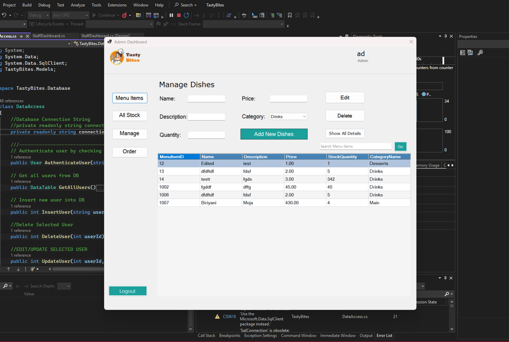
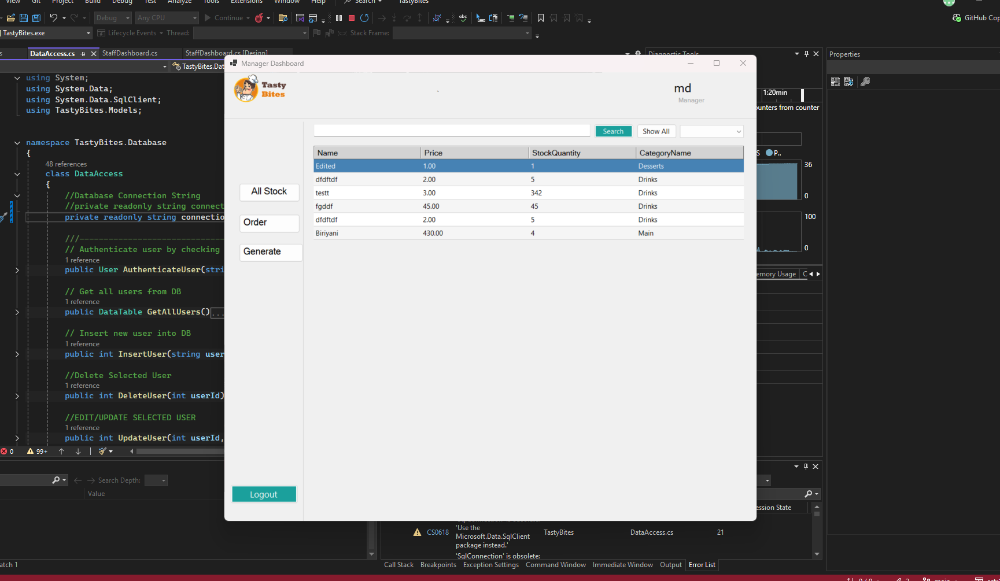
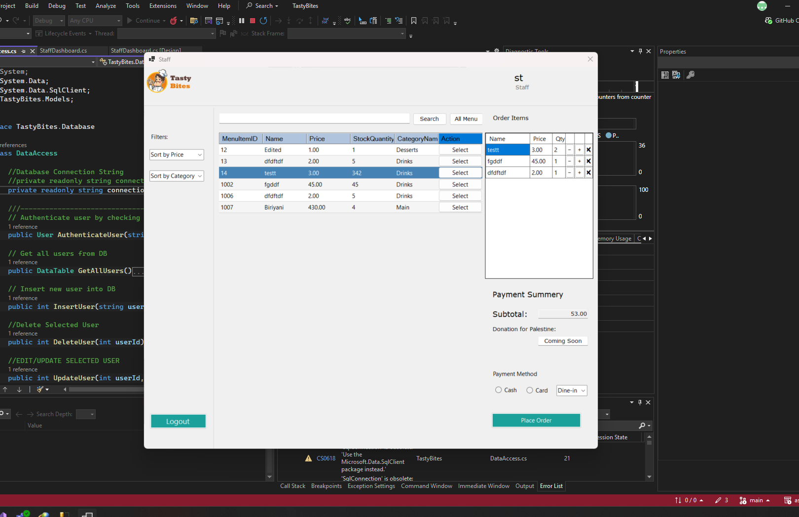

# 🍽️ Restaurant Management – C# Desktop POS System

A role-based desktop application built with C# to help small restaurants manage orders, menus, staff activities, and sales reports effectively — all without the cost of an expensive POS system.

---

## 📌 Project Description

**Restaurant Order Tracker** is a basic yet powerful desktop application tailored for small-scale restaurants to improve order accuracy, streamline staff communication, and monitor sales performance. The system features **role-based access control** (Admin, Manager, Staff), ensuring each user has specific, relevant permissions.

---

## ⚠️ Problem Identification

Many small restaurants still rely on manual order handling, which can lead to:

- Miscommunication between waitstaff and kitchen
- Incorrect or lost orders
- No visibility into order status or sales data
- Inability to manage menu or stock effectively

---

## 🎯 Project Goals

- Improve **order accuracy and speed**
- Bridge communication between service staff and kitchen
- Provide real-time **order tracking**
- Generate insightful **sales reports**
- Offer a **cost-effective POS alternative** for small restaurants
- Serve as a practical project for learning **C# fundamentals**

---

## ✅ Objectives

- Develop a C# desktop application with an intuitive user interface
- Implement a **login system** with role-based access
- Enable **CRUD** operations for menu and order management
- Track **order history** and **generate sales reports**
- Monitor **inventory** and trigger low-stock alerts

---

## 👥 User Roles & Responsibilities

### 👑 Admin
- Manage users (Add/Edit/Remove Managers and Staff)
- Create, update, or delete menu items
- Manage ingredient inventory levels
- Access and view all reports
- Track and search **Manager activity**

### 🧑‍💼 Manager
- Monitor real-time order queue
- Generate **daily, weekly, and monthly** sales reports
- Track popular and underperforming menu items
- Check stock levels and low-stock alerts
- Search and review **Staff activity**

### 🧑‍🍳 Staff
- Take and place customer orders
- View only available menu items
- Mark order types (e.g., **Dine-in**, **Takeaway**)

---

## 🔑 Key Features

- 🔐 **Role-based login system**
- 📋 **Menu Management** (Add/Edit/Delete items)
- 📝 **Real-time order placement and status tracking**
- 📊 **Sales reporting** (daily, weekly, monthly)
- 📦 **Low-stock alerts**
- 📌 **User activity logging**
- 🧾 Optional: **Receipt/Bill generation**
- 🖥️ Simple, clean, and responsive desktop UI

---

## 📖 Usage Scenario

At **Tasty Bites**, a busy local restaurant:

- The **Admin (Meraz)** configures user accounts, updates the menu, and manages ingredient stock.
- The **Staff (Razoanur)** quickly places orders by selecting available items and assigning an order type. The system ensures smooth coordination between the front and back of house.
- The **Manager (Ahsanul)** monitors ongoing operations, evaluates item performance, and generates reports to help the team make informed decisions.

This system reduces human error, enhances workflow, and supports business growth.
## 📸 Screenshots

### 👑 Admin Dashboard

### 🔐 Manager Dashboard

### 🧑‍🍳 Staff Order Interface

---

## 🛠️ Technologies Used

- C# (.NET Windows Forms)
- SQL Server / Local Database
- Visual Studio
- Entity Framework (optional for DB handling)
- Git for version control

---

